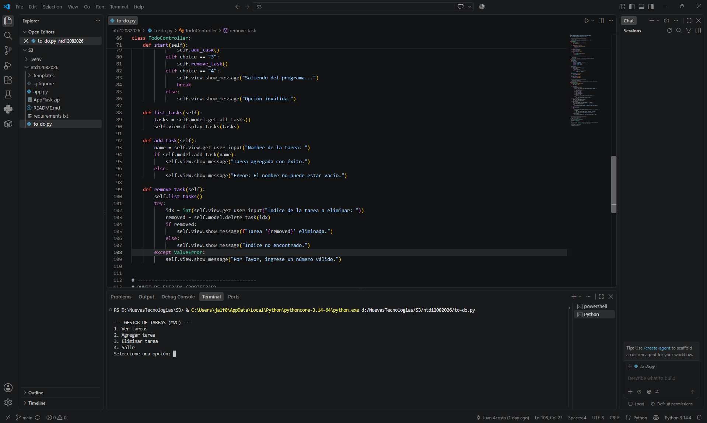
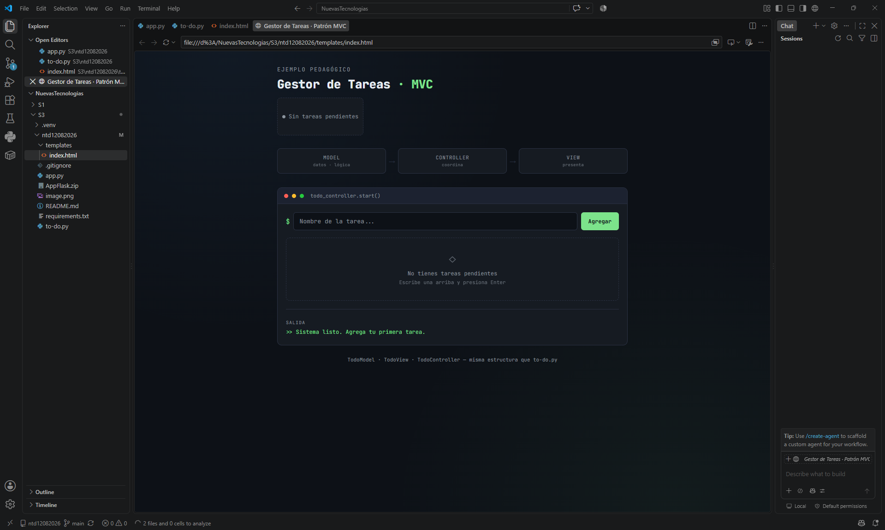

# Aplicación Flask - To-Do List

Aplicación web desarrollada con Flask que permite gestionar una lista de tareas (to-do list).

## Tecnologías usadas
- Python
- Flask
- Git / GitHub

## Requisitos previos
- Tener Python instalado
- Tener Git instalado

## Instrucciones de instalación y ejecución

### 1. Clonar el repositorio
```bash
git clone https://github.com/Hatchedbot/ntd12082026.git
cd ntd12082026
```

### 2. Crear entorno virtual
```bash
python -m venv env
```

### 3. Activar entorno virtual
```bash
env\Scripts\activate
```

### 4. Instalar librerías necesarias
```bash
pip install -r requirements.txt
```

### 5. Ejecutar la aplicación
```bash
python to-do.py
```

## Control de versiones (comandos usados durante el desarrollo)

```bash
# Inicializar repositorio
git init

# Agregar cambios al staging
git add .

# Confirmar cambios
git commit -m "mensaje"

# Conectar con el repositorio remoto
git remote add origin https://github.com/Hatchedbot/ntd12082026.git

# Subir cambios
git push -u origin main
```

## Evidencia de ejecución

[Evidencia de ejecución] 


## Autor
Joan Sebastian Lara Fuenmayor - 506242012